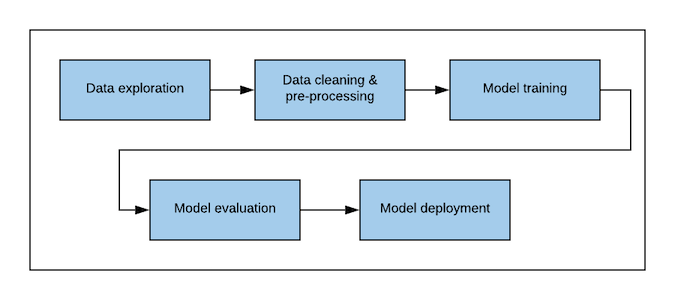
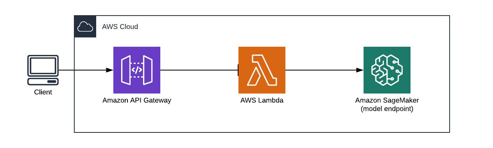

# Machine Learning Engineer Nanodegree

## Capstone Proposal

Johan Kielbaey  
June 20th, 2020

## Proposal

### Domain Background

Physics is the study of matter and energy within the boundaries of space and time. Through mathematical models physicists describe the world around us, ranging from subatomic particles to the movement of galaxies. An important aspect of physics is experimental verification of those mathematical models. Every theory must be confirmed by observations (e.g. The bending of light near massive objects as predicted by Albert Einstein's Theory of General Relativity was observed in 1919 during a solar eclipse [[1](https://www.britannica.com/science/relativity/Experimental-evidence-for-general-relativity))].

In 1964 Peter Higgs, Robert Brout and François Englert theorized the Higgs mechanism and predicted the existence of the Higgs fields and Higgs Boson. In essence, the Higgs Boson is the subatomic particle that provides mass to matter through its interaction with the Higgs field. Unlike the observations that confirm the bending of light, a subatomic particle is so small that it cannot be observed directly. In addition the Higgs Boson only exists for a fraction of time (\\( 1.6 * 10^{-22}s \\)) before it decays into lighter particles, which makes detecting the Higgs Boson even more difficult [[2](https://en.wikipedia.org/wiki/Higgs_boson)]. Instead physicists rely on indirect detection by measuring the properties of the decaying stable particles after making protons collide near the speed of light inside a particle accelerator (such as the Large Hadron Collider (LHC) at CERN). In 2012 CERN announced a particle matching the properties of the Higgs Boson was found, but further validation was required [[3](https://home.cern/science/physics/higgs-boson)].

Experiments run at LHC produce about \\(10^{11}\\) collisions every hour. On average in about 300 collisions a Higgs Boson is formed [[4](https://rdcu.be/b442C)]. The sheer amount of data generated during such experiments require the use of reliable and accurate algorithms and models to retain only the data of collisions that is relevant for further analysis.

*Personal motivation*: While looking for an interesting topic for my capstone project, I came across the HIGGS data set and linked research paper ([[4](https://rdcu.be/b442C)][[5](http://archive.ics.uci.edu/ml/datasets/HIGGS)]). For a long time, I've been interested in modern physics. Its concepts, such as time dilation, the effects of mass on space and time and quantum teleportation, spark my curiosity. Reason why I choose to focus my capstone project on the classification of events from the HIGGS data set.

### Problem Statement

The main problem to solve in this capstone project is to create a well-trained model to classify collision events either as Signal or as Background with a high level of accuracy. A Signal means that the collision produced particles of interest for further research. Background means that the collision produced other particles not relevant for this research.

The input for the model will be the measurements of these collision events.

### Datasets and Inputs

The dataset used for the capstone project is the HIGGS data set, available at the UCI Machine Learning Repository on the following link [[5](http://archive.ics.uci.edu/ml/datasets/HIGGS)]. It contains 11,000,000 items with 28 features. Each item contains the measurements of collision events generated using Monte Carlo methods. These events can either be Signal or Background.

The 28 features consist of 21 low-level and 7 high-level kinematic features of these collision events. All of these are numeric features. The low-level (or raw) features are measured by the particle detectors in LHC. The high-level features are functions of these raw features that are manually derived by physicists in order to increase accuracy of the models used at the time of creation of the data set.

### Solution Statement

The goal is to classify a collision event as either Signal or Background, making this a binary classification problem. The proposed solution is to use a deep neural network.

Previously, shallow neural networks and decision tree based models have been used and were able to achieve good results thanks to the creation of the high-level features. However, being able to achieve the similar or better results using only the low-level features, improves the efficiency of the process given that no high-level features have to be defined manually.

The project will have 2 deliverables:

1. A _trained model_ that is capable of reliably classifying an event as either Signal or Background.
2. A _REST API_ that uses the trained model to facilitate inference for _large amounts of events_ effectively. It will be interesting to compare inference via a model endpoint vs a batch transform job.

### Benchmark Model

The research paper referred to in the data set compares a couple of different models, which will be used as a benchmark. The table below presents the accuracy under ROC curve (AUC) for each of the models used.

| Model | Low-level features | High-level features | Low+High-level features |
|:-----:|:------------------:|:-------------------:|:-----------------------:|
| Boosted Decision Tree | 0.73 | 0.78 | 0.81 |
| Shallow NN | 0.733 | 0.777 | 0.816 |
| Deep NN | 0.880 | 0.800 | 0.885 |

The best result was obtained using a deep neural network using both the low and high-level features as input. The score was 0.885 which means that 88.5% of the events were classified correctly.

### Evaluation Metrics

The amount of "interesting" events is very small compared to the total number of events. From a research perspective, it is important not to misclassify actual Signals (false negatives) as this would mean missed opportunities to learn more about the Higgs Boson. At the same time the model should also not result in too many Backgrounds classified as Signals (false positive) as this would result in research effort wasted on irrelevant events.

_Recall_ is the metric showing us how many of the Signal events have actually been classified correctly. A low recall means that many Signal events were classified as Background, which is definitely not good. _Precision_ is a different metric and it shows how many of the events classified as Signal are in fact Signal. If this metric is low, then many Background events have been classified as Signals. This leads to more events that will be investigated further. Ideally, the model that has a high recall and high precision. However often optimizing for 1 metric means sacrificing on the other metric.

The _Area under the ROC Curve_ (AUC) metric provides a balance between both. The Receiver Operating Characteristic (ROC) curve shows the relation between recall and precision. A higher value means that the model is better at classifying.

Similar to the benchmark models, in this project the AUC metric will be used.

### Project Design

A typical machine learning workflow consists of a set of stages as illustrated in the diagram below.

1. During the _data exploration_ phase, the goal is to get better awareness of the data set. Questions to be answered include:

- What are the dimensions of the data set?
- Are the features numerical or categorical?
- Are there missing values?
- Is the data set balanced? (Are the different classes equally represented?)
- For numerical features we should look into the statistical distribution of each feature
- For categorical features into the frequency of each of the values

1. The _data cleaning and preprocessing_ stage will start by analyzing the missing values. The description of the data set used indicates there are no missing values, but nevertheless this needs to be verified. If there are missing values, the way to deal with them is either through imputation (replacing with a statistical value -- the mean or median) or removing the row/feature (if the row/feature contains many missing values).  
The next step is to apply feature engineering. For numerical features, feature scaling (standardizing the values of the features) must be applied. The reason for this is to avoid that a model will assign more importance to a particular feature only because its values are larger. The data set used in this project only contains numerical features, but if there would be categorical features they would have to be encoded using e.g. One Hot Encoding.  
The final action in this stage is to split the data set into a training, validation and test set. As the name implies the training set will be used to train a model. The validation set will be used to evaluate each model during hyperparameter tuning and as such will indirectly affect the model. The test set will only be used at the end of the training to evaluate how the model performs on data it has never seen before. A commonly used distribution is 70% for training, 15% for validation and 15% for testing.

1. To _train the model_, a hyperparameter tuning job in Sagemaker will be used. The model will be a deep neural network with a configurable number of hidden layers. The size of the input layer will match with the number of features in the data set (the 21 low-level features). The output layer will only have 1 node. In between the hidden layers, dropout will be added. In addition, the effect of batch normalization will be checked. As the activation function between hidden layers, ReLU will be used. As an activation function for the output layer both tanh and sigmoid will be tested.  
The hyperparameters for a deep neural network are as follows: number of hidden layers, number of nodes in the hidden layers, dropout ratio, learning rate, number of epochs to train the model and the batch size.

1. After a model has been trained, it must be evaluated using the test set. This will be done using a Sagemaker Transform job. If the outcome is satisfactory, the model can be used for deployment.

1. As mentioned in the solution statement, the purpose is to create an API that facilitates efficient prediction of events. The API will be created using Amazon API Gateway, AWS Lambda and Amazon Sagemaker. The REST API should be designed to accept a json document containing the data of the events. The Lambda function handles the incoming request and invokes the model endpoint to get the predictions and then pass the results back. The design of this API is illustrated in the diagram below.

## References

- [1] <https://www.britannica.com/science/relativity/Experimental-evidence-for-general-relativity>
- [2] <https://en.wikipedia.org/wiki/Higgs_boson>
- [3] <https://home.cern/science/physics/higgs-boson> (An elusive particle)
- [4] Baldi, P. et al. Searching for exotic particles in high-energy physics with deep learning. Nat. Commun. 5:4308 doi: 10.1038/ncomms5308 (2014).
- [5] <http://archive.ics.uci.edu/ml/datasets/HIGGS> - <http://archive.ics.uci.edu/ml/machine-learning-databases/00280/HIGGS.csv.gz>

-----------
